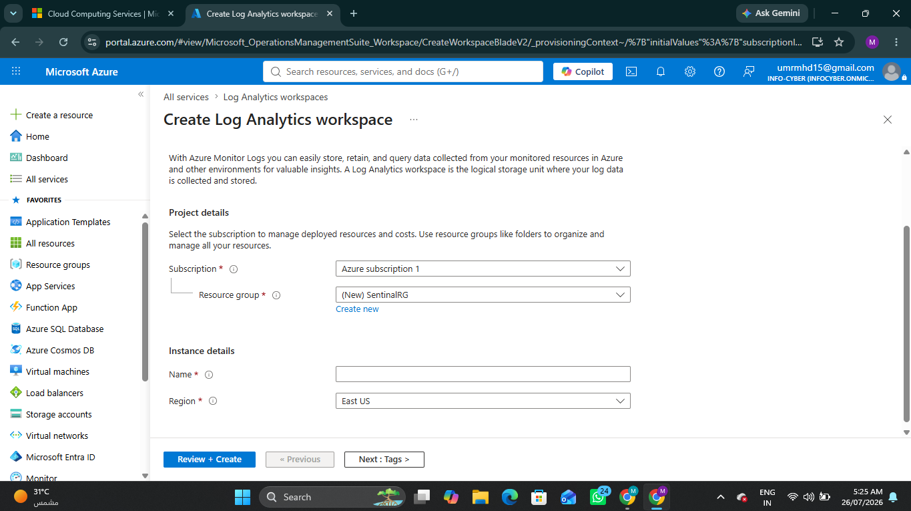
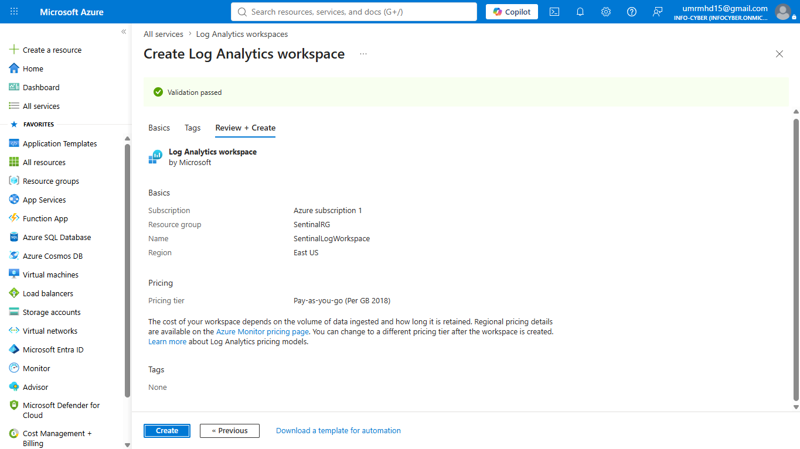
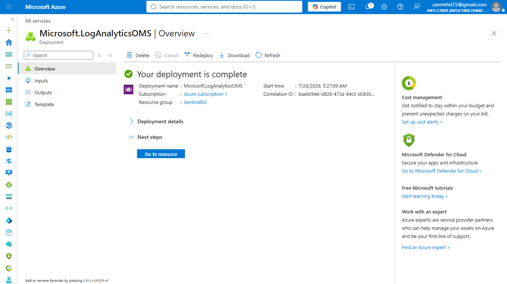
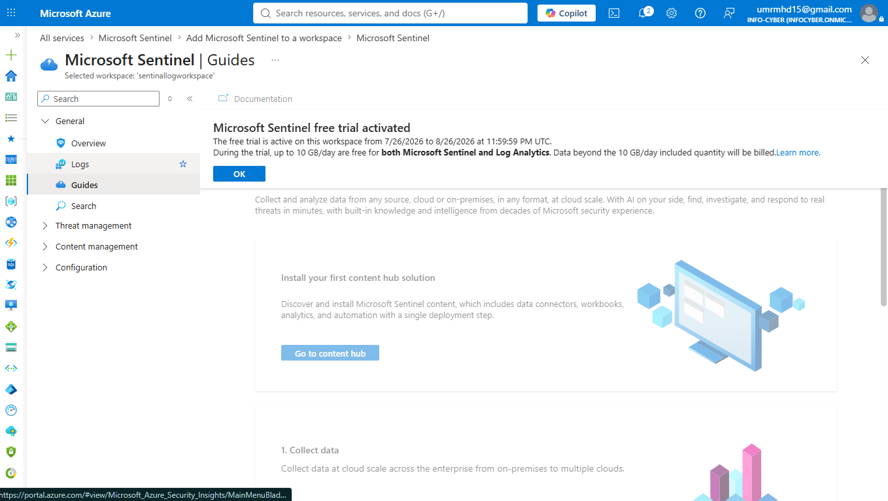

# Microsoft Sentinel Deployment

## Overview

Microsoft Sentinel is Microsoft's cloud-native Security Information and Event Management (SIEM) and Security Orchestration, Automation, and Response (SOAR) platform. It provides centralized security monitoring, threat detection, investigation, and response across cloud and on-premises environments.

As part of my Microsoft Security Operations (SOC) Home Lab, I deployed Microsoft Sentinel to build a centralized security monitoring environment for SC-200 learning and hands-on practice.

---

## Objectives

- Deploy Azure Log Analytics Workspace
- Enable Microsoft Sentinel
- Prepare the environment for security monitoring
- Build the foundation for threat hunting and incident response

---
## Deployment Workflow
Azure Subscription
        │
        ▼
Resource Group
        │
        ▼
Log Analytics Workspace
        │
        ▼
Microsoft Sentinel
        │
        ▼
Data Connectors
        │
        ▼
Analytics Rules
        │
        ▼
Incidents
        │
        ▼
Threat Hunting

## Architecture

> Architecture diagram will be added as the Microsoft Security Operations Home Lab progresses.

## Environment

| Resource | Configuration |
|----------|---------------|
| Cloud Platform | Microsoft Azure |
| SIEM | Microsoft Sentinel |
| Workspace | SentinelLogWorkspace |
| Resource Group | SentinelRG |
| Region | East US |

---

# Step 1 – Create Log Analytics Workspace

A Log Analytics Workspace was created to collect, store, and analyse security logs. This workspace serves as the data repository used by Microsoft Sentinel.

### Screenshot

---

# Step 2 – Review Configuration

Azure validated the deployment configuration before creating the Log Analytics Workspace. This ensured that the subscription, resource group, workspace name, region, and pricing configuration were correct.

### Screenshot

---

# Step 3 – Deployment Completed

The Log Analytics Workspace deployment completed successfully. The workspace is now ready to ingest telemetry from connected Microsoft security services.

### Screenshot

---

# Step 4 – Enable Microsoft Sentinel

Microsoft Sentinel was enabled using the newly created Log Analytics Workspace.

After activation, the platform provides capabilities including:

- Security Monitoring
- Incident Management
- Threat Hunting
- Analytics Rules
- Automation
- Workbooks

### Screenshot

---

# Outcome

The Microsoft Sentinel deployment was successfully completed using an Azure Log Analytics Workspace.

The environment now serves as the centralized SIEM platform for my Microsoft Security Operations Home Lab and is ready for:

- Microsoft Defender XDR integration
- Microsoft Entra ID log collection
- Microsoft 365 security data connectors
- Custom Analytics Rules
- Incident investigation
- Threat Hunting with KQL
- Automation Rules and Playbooks
- SOC dashboards using Workbooks
